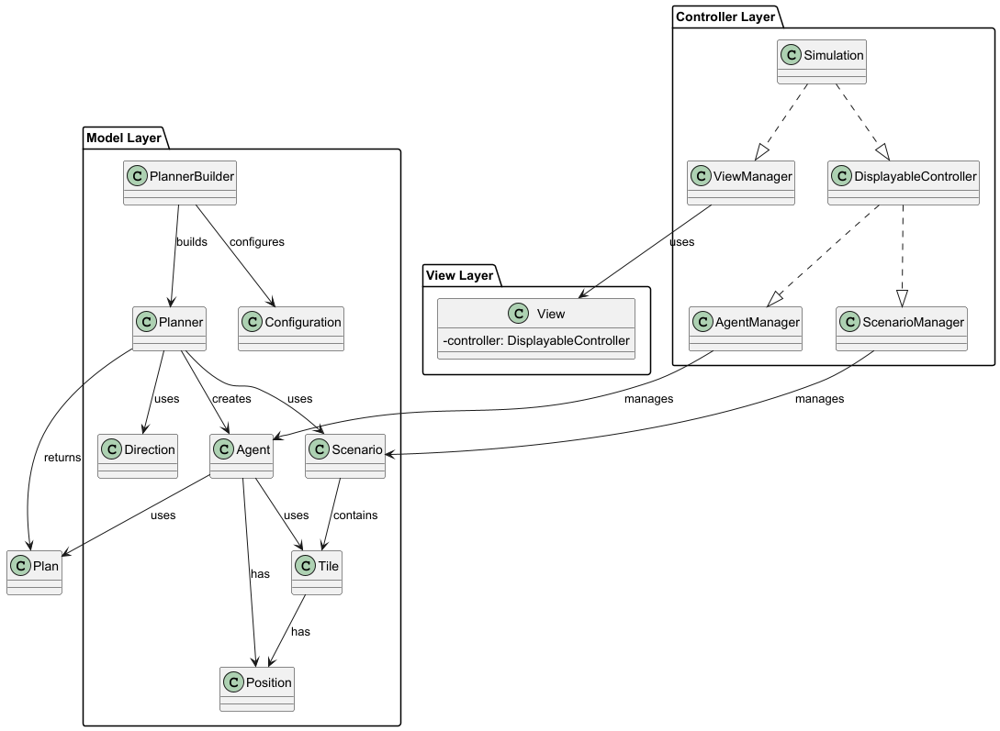

# Architectural Design

Il progetto adotta un'architettura MVC: 
1. **Model**: contiene le entità che fanno parte della simulazione, come l'agente, lo scenario, le caselle, le direzioni, etc. 
2. **View**: mostra la simulazione e permette di configurare i parametri di esecuzione.
3. **Controller**: gestisce l'interazione tra il modello e la vista, orchestrando l'esecuzione della simulazione e le varie transizioni di stato.

Altri layer sono stati aggiunti per implementare le logiche di pathfinding, interagire con i planner o per gestire l'interazione con Prolog.
* **Planning**: contiene gli algoritmi di pathfinding e le classi per la configurazione dei planner. 
* **Integration**: specifico per l'integrazione con Prolog, contiene le classi per eseguire query e fare il parsing dei risultati. 

L'architettura generale prevede una suddivisione del controller in moduli che gestiscono aspetti diversi della simulazione e del funzionamento generale: 
- **DisplayableController** aggrega scenario, algorithm, direction e la gestione degli agent, fungendo da interfaccia principale per la view e la simulation. 
- **ViewManager** fornisce i metodi per aggiornare e controllare la UI in base agli eventi della simulation e degli agent. 
- **Simulation** tiene traccia dello stato della simulation, impostabile sia da controller che view. 
- **AgentManager** è responsabile delle azioni e del planning degli agent, e interagisce con gli scenario e algorithm manager tramite DisplayableController.

Invece i concetti principali del modello sono:
- **Tile**: rappresenta una casella nello scenario, che può essere di tipo passabile, ostacolo, speciale od obiettivo.
- **Scenario**: rappresenta l'ambiente in cui gli agenti si muovono, costituito da una griglia di caselle di diverso tipo.
- **Direction**: rappresenta le direzioni in cui gli agenti possono muoversi nello scenario, come le direzioni cardinali o diagonali.
- **Plan**: rappresenta un piano di azione calcolato per un agente, che include una sequenza di direzioni da seguire.
- **Algorithm**: rappresenta un algoritmo di pathfinding utilizzato per calcolare i piani degli agenti.
- **Configuration**: contiene le impostazioni per la simulazione, come il tipo di scenario, le dimensioni, la posizione iniziale e il goal.
- **Planner**: incapsula una configurazione e un algoritmo di pathfinding, permettendo di calcolare un piano che sarà eseguito da un agente.
- **Agent**: rappresenta un agente che si muove nello scenario, ha un suo stato interno, esegue le istruzioni del piano calcolato.

A livello di utilità e wiring, il Planner Builder riveste un ruolo importante: 
- Permette di creare una configurazione sulla quale poi costruire un planner. 
- In base al tipo di algoritmo selezionato istanzia un Planner concreto adatto. 
- Ogni Planner concreto incapsulerà la sua logica di calcolo del piano.

  

| [Previous Chapter](../3-requirements/index.md) | [Index](../index.md) | [Next Chapter](../5-detailed_design/index.md) |