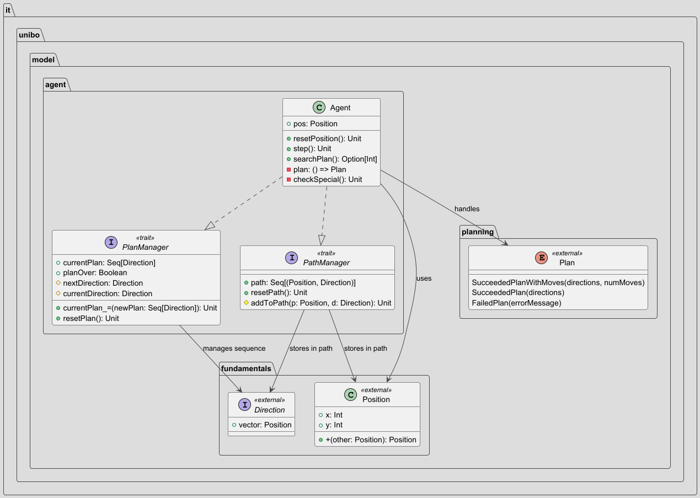

# Agent

L'`Agent` rappresenta l'entità centrale del sistema di navigazione, implementando un **design modulare basato su trait 
specializzati** che separano chiaramente le responsabilità di gestione del piano e del percorso.

  

La classe `Agent` eredita da due trait fondamentali:
- **PlanManager**: Gestione dell'esecuzione sequenziale delle direzioni
- **PathManager**: Tracciamento della storia dei movimenti (sequenza di posizioni e direzioni)

L'`Agent` riceve il piano da eseguire tramite parametro alla sua inizializzazione, insieme al metodo `checkSpecial()`, fondamentale
per gestire le tile con comportamenti speciali (es.: teletrasporto), mantenendo la logica di movimento pulita.

[Index](../index.md)
