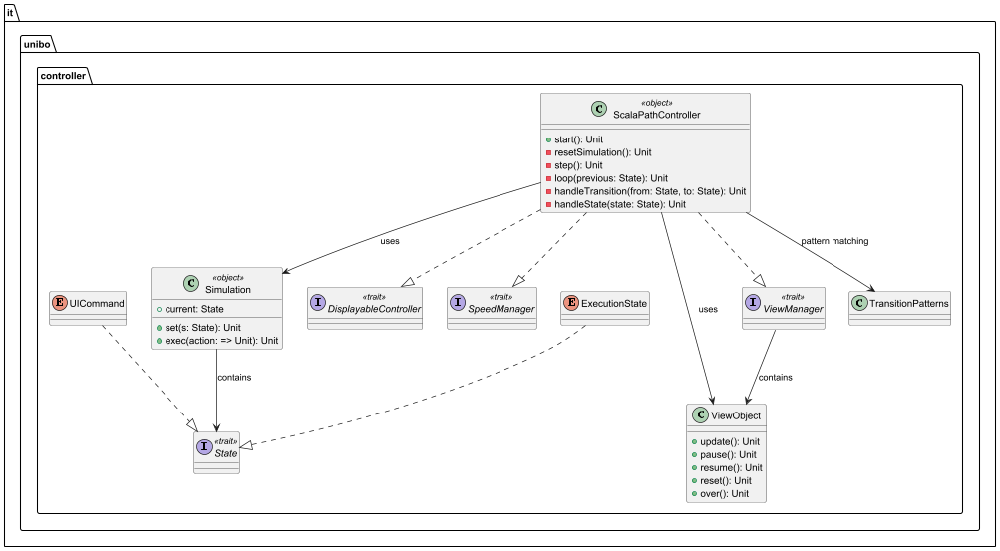
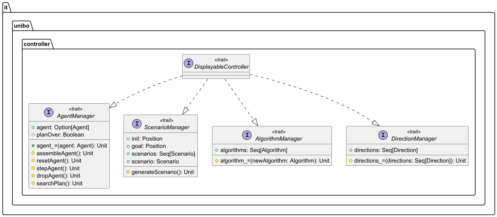

# ScalaPathController

Il `ScalaPathController` implementa un'**architettura modulare basata su mixin** che rappresenta il cuore del sistema di
pathfinding, orchestrando l'intera simulazione attraverso trait specializzati.

## Architettura Generale

  

Il controller estende:
- **DisplayableController**: Gestione scenario, algoritmi, direzioni e agente
- **SpeedManager**: Controllo timing della simulazione
- **ViewManager**: Interazioni thread-safe con l'UI

Utilizzando pure l'object `Simulation` che incapsula lo stato della simulazione, che può essere
o uno stato d'esecuzione (`ExecutionState`), o un evento scaturito dall'interfaccia (`UICommand`). 

## DisplayableController

  

Aggrega quattro manager specializzati per la configurazione completa del modello della simulazione, fornendo un unica interfaccia
per la View sul Controller principale, mostrando solo ciò che è necessario:
- **AgentManager**: Gestione del movimento dell'agente, del piano d'esecuzione e del suo percorso
- **AlgorithmManager**: Contiene la lista degli algoritmi disponibili e la selezione corrente
- **ScenarioManager**: Contiene la lista degli scenari disponibili e ne permette il cambio e la generazione
- **DirectionManager**: Contiene la lista, compilabile a piacere, delle possibili direzioni che l'agent può intraprendere

[Index](../index.md)
