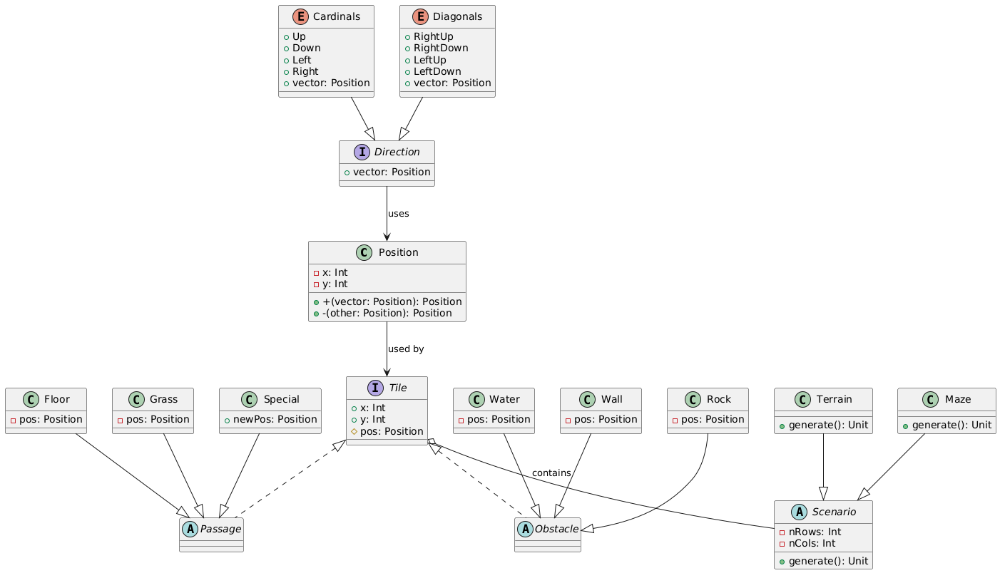

## Model

Il model racchiude i concetti e le entità principali che rappresentano il dominio della simulazione: 
1. **Direction**: rappresenta tutte le possibili direzioni in cui un agente si può muovere, in questo progetto abbiamo incluso qulle cardinali (su, giù, destra, sinistra) e quelle diagonali (alto-sinistra, alto-destra, basso-sinistra, basso-destra). 
2. **Position**: rappresenta una posizione nella griglia, può essere riferita ad una casella o ad un agente, internamente contiene due coordinate (x e y).
3. **Tile**: rappresenta una cella della griglia, ce ne possono essere di diverso tipo. La distinzione maggione srisiede tra le celle percorribili e quelle che rappresentano ostacoli. Le prime possono essere attraversate dall'Agent, mentre le seconde no.
4. **Scenario**: rappresenta un insieme di tile che formano una griglia, il tiling può essere di diverso tipo ad esempio labirinto o terreno.
5. **Agent**: entità attiva con uno stato interno che si muove all'interno dello scenario. 

Il comportameno dell'agent è influenzato dal tipo di algoritmo di pathfinding selezionato e dal tipo di scenario in cui si trova. Ha bisogno di queste informazioni per poter funzionare. Anche la scelta delle direzioni di movimento ammesse avrà influenza sul piano calcolato ed eseguito dall'Agent.

  

[Index](../index.md)
