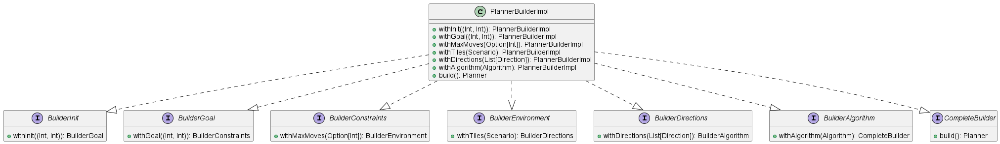

## Planner Builder

Il PlannerBuilder rappresenta l'entry-point per creare e configurare un Planner, il quale poi calcolerà un piano di movimento. 

Il PlannerBuilder è costituito da una serie di interfacce che rappresentano i passaggi di una pipeline 
per costruire la configurazione del Planner.

In base alla configurazione scelta, il Builder creerà un Planner specializzato, 
ad esempio algoritmi diversi portano a Planner concreti diversi.

  

