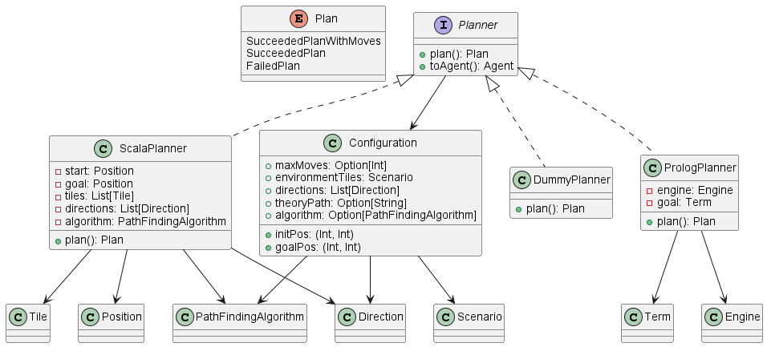

## Planner

Il Planner è un interfaccia che incapsula una configurazione ed un algoritmo di pathfinding.
La configurazione comprende tutte le informazioni legate allo scenario, alla posizione iniziale ed al goal.
Inoltre la configurazione determina anche quali movimenti può fare l'agente all'interno dello scenario. 
Ad esempio potrebbe venir configurato per muoversi solo in diagonale.

L'interfaccia Planner viene poi concretizzata da delle classi che utilizzano effettivamente la configurazione 
per calcolare un piano di movimento. In base al risultato della ricerca ritornano un successo o un fallimento.

Il Planner offre poi la possibilità di creare un agente con un proprio stato interno 
che incapsula il piano calcolato dal Planner.

  

[Index](../index.md)
