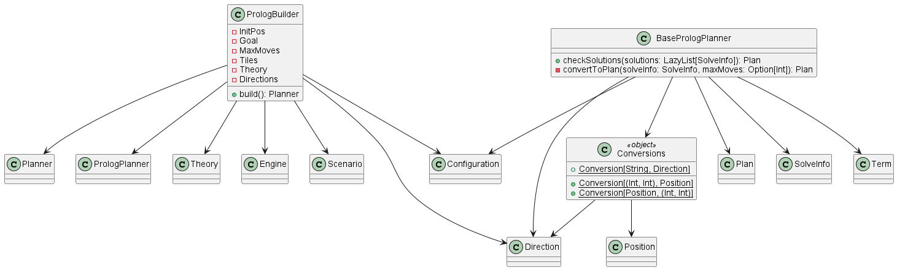

## PrologBuilder & PrologPlanner

Il PrologBuilder è una classe concreta che implementa l'interfaccia `PlannerBuilder` e 
costruisce un `PrologPlanner`, il quale è una classe concreta che implementa l'interfaccia `Planner`.

Il PrologBuilder riceve la configurazione completa dal PlannerBuilder e converte tutti i dati in un formato usabile da Prolog. 
Dopodiché ritorna un PrologPlanner pronto ad essere utilizzato. 

Il PrologPlanner invece si occupa di interagire con Prolog tramite query e di fare il parsing dei risultati.
Il PrologPlanner sarà incapsulato all'interno di un Agent che lo utilizzerà per calcolar e
convertire il piano di movimento in un formato comprensibile per l'agente.

  

[Index](../index.md)
