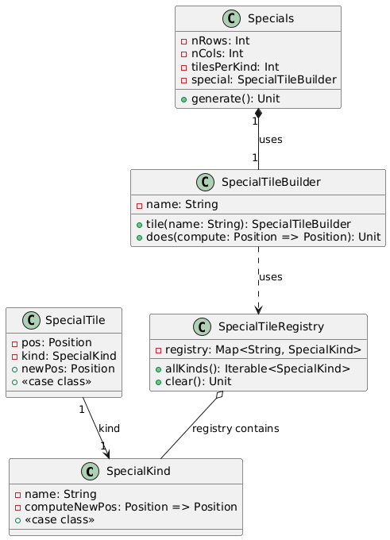

## Specials Tiles

Le caselle speciali hanno un effetto speicale sull'agente,
cioè quando vengono attraversate spostano l'agente in una nuova posizione. 
La nuova posizione è determinata dal tipo di casella speciale. 

Le tipologie di caselle speciali sono definite attraverso un SpecilTileBuilder  
e vengono prima salvate come tipi e poi al momento della creazione dello scenario,
vengono istanziate diverse caselle per ogni tipo.

Un esempio di casella speciali che abbiamo definito nella simulazione è 
il teleport, che sposta l'agente in una posizione casuale.

Una possibile estensione potrebbe prevedere di offrire all'utente 
la possibilità di definire le proprie caselle speciali o scegliere tra 
un insieme predefinito.

  

