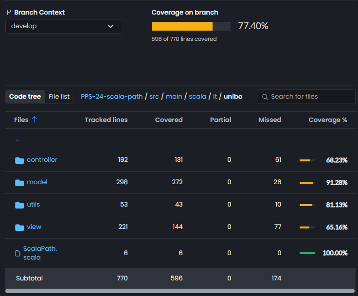

# Testing

Abbiamo usato Scala Test per fare unit testing, i quali sono stati poi automatizzati usando le GitHub Actions.
Abbiamo utilizzato il DSL offerto da Scala Test per scrivere test espressivi e leggibili, ad esempio: 

```scala
  "A Maze Scenario" should "generate some tiling" in :
    val scenario: Scenario = Maze(3,3)
    scenario.generate()
    scenario.tiles should not be empty
```

### TDD
Abbiamo cercato di adottare il TDD quando ci sembrava naturale farlo, e poiché abbiamo effettuato molti refactoring, i test sono evoluti insieme al codice, in modo da non rimanere mai senza coverage e feedback. Dobbiamo ammettere che non è stato facile seguire l’approccio TDD, perché spesso non eravamo sicuri su come fare le cose e su come scrivere il codice; scrivere test a priori a volte ci ha aiutato, altre volte è stato semplicemente difficile.

### Coverage
All'inizio del progetto, ci siamo posti l'obiettivo di raggiungere una test coverage del 60-70%. Alla fine del progetto siamo riusciti a raggiungere il 77.40%.
Ci siamo concentrati più sulla qualità che sulla quantità: invece di scrivere molti test, abbiamo cercato di scrivere test utili che verificassero effettivamente funzionalità importanti dell'applicazione. Infatti, molti bug sono stati scoperti proprio in questo modo. 

Siamo anche riusciti a raggiungere una buona copertura con pochi test, perché abbiamo testato tutte le funzionalità che coinvolgono parti importanti del codice e l'integrazione tra di esse. Abbiamo cercato di testare tutte le funzionalità cruciali, ciò che non è stato testato riguarda spesso codice di utilità che non è coinvolto nelle funzionalità principali.
Abbiamo aumentato la copertura anche costruendo una `ViewMock` per testare il comportamento della `View` e la sua interazione e il suo uso nel `Controller`.

<p align="center">
  
</p>

### Grid DSL
Infine, uno di noi ha costruito un DSL grafico per migliorare i test sugli Scenari. Il DSL utilizza alcuni caratteri speciali per costruire graficamente gli scenari in uno stile simile all'ASCII-art, questi scenari vengono poi utilizzati da dei test per le celle di tipo  speciale e il funzionamento degli algoritmi di pathfinding. 

```scala
class TestScenarioWithClosedWalls extends Scenario(10, 10):
  private val p = Position(7, 8)
  override def generate(10): Unit =
    _tiles = grid:
      F | F | F | F | F | F | F | F | F | F
      F | F | TP(p) | F | F | F | F | F | F | F
      F | F | F | F | F | F | F | F | F | F
      F | F | F | F | F | F | F | F | F | F
      F | F | F | F | F | F | F | F | F | F
      F | F | F | F | F | F | F | F | F | F
      F | F | F | F | F | F | W | W | W | W
      F | F | F | F | F | F | W | F | F | W
      F | F | F | F | F | F | W | F | F | W
      F | F | F | F | F | F | W | W | W | W
```


| [Previous Chapter](../6-implementation/index.md) | [Index](../index.md) | [Next Chapter](../8-process/index.md) |
